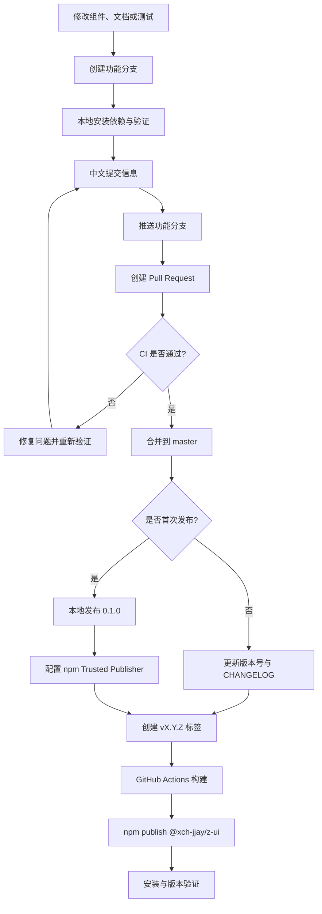
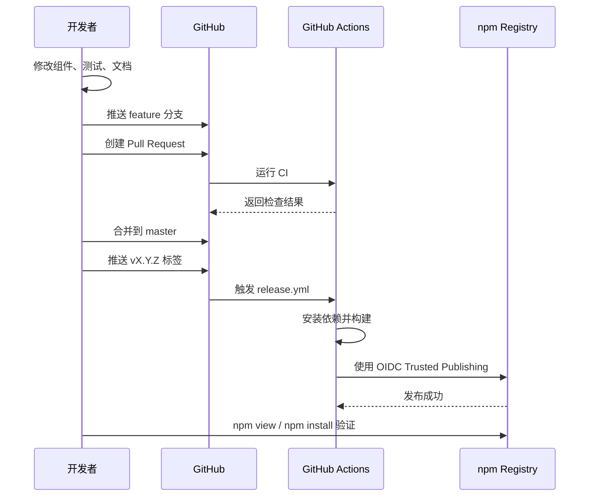

# z-ui Monorepo 发布 npm 包操作手册

> 适用项目：`xch-jjay/x-norpr-ui`  
> 适用包：`@xch-jjay/z-ui`  
> 当前已发布版本：`0.1.0`  
> 技术栈：Vue 3、TypeScript、pnpm workspace、GitHub Actions、npm Trusted Publishing

## 1. 先看结论

这个仓库是一个 monorepo。仓库根目录负责统一管理代码、依赖、测试、构建和文档；真正发布到 npm 的包是 `packages/z-ui`。

发布链路如下：



当前项目的关键结论：

- 根包 `@z-ui/monorepo` 是私有包，不能发布。
- 公开包是 `@xch-jjay/z-ui`，发布目录是 `packages/z-ui`。
- 第一个版本 `0.1.0` 已经手动发布成功。
- 后续版本应该由 GitHub Actions 根据版本标签自动发布。
- 不要把 npm 密码、访问令牌、2FA 恢复码提交到 Git 仓库。

## 2. Monorepo 目录和发布边界

| 位置 | 作用 | 是否直接发布 |
| --- | --- | --- |
| `package.json` | 根工作区、统一脚本、私有 monorepo 元数据 | 否 |
| `packages/z-ui` | 对外使用的 Vue 组件库入口 | 是 |
| `packages/components` | Button、Icon 等组件源码 | 通常由 z-ui 打包，不单独发布 |
| `packages/theme-chalk` | SCSS 主题样式 | 通常由 z-ui 打包，不单独发布 |
| `packages/utils` | 内部构建和安装工具 | 否 |
| `docs` | VitePress 文档站 | 否 |
| `.github/workflows/ci.yml` | Pull Request 和 master 的质量检查 | 否 |
| `.github/workflows/deploy-docs.yml` | GitHub Pages 文档部署 | 否 |
| `.github/workflows/release.yml` | 根据 Git 标签发布 npm | 否 |

最容易犯的错误是站在仓库根目录执行 `npm publish`。根包声明了 `private: true`，因此会得到 `EPRIVATE`。正确做法是明确指定发布目录：

```powershell
npm publish .\\packages\\z-ui --access public --registry=https://registry.npmjs.org/
```

## 3. 环境要求

推荐固定以下版本，避免锁文件和本地环境不一致：

- Node.js：22.14+，或 Node.js 24
- pnpm：11.16.0
- npm：随 Node.js 安装，建议使用最新稳定版本
- Git
- npm 账号：`xch-jjay`
- npm 账号已启用 2FA，建议使用安全密钥
- GitHub 仓库推送和合并权限

### 3.1 Windows 环境切换 Node 和 pnpm

```powershell
nvm list
nvm install 22.14.0
nvm use 22.14.0
node --version

corepack enable
corepack prepare pnpm@11.16.0 --activate
corepack pnpm --version
```

如果直接执行 `pnpm --version` 仍然显示旧版 `8.6.0`，说明 PowerShell 仍然命中了旧的全局 shim。此时优先使用：

```powershell
corepack pnpm install --frozen-lockfile
corepack pnpm build
```

不要为了绕过版本问题直接执行 `pnpm install --force`。这可能重新生成不兼容的 `pnpm-lock.yaml`，造成 CI 和其他开发者环境不一致。

## 4. 每次开发前的标准流程

### 4.1 确认工作区干净

```powershell
git status
```

如果发现 `npm_recovery_codes.txt`、`.npmrc` 或其他凭证文件，先移出仓库。恢复码属于高敏感信息，不能上传、截图或发送给他人。

### 4.2 从最新 master 创建功能分支

```powershell
git switch master
git pull origin master
git switch -c feature/button-disabled
```

分支名称应表达实际工作内容，例如：

```text
feature/button-disabled
feature/input-component
fix/style-import
docs/npm-release-guide
```

### 4.3 安装锁定版本依赖

```powershell
corepack pnpm install --frozen-lockfile
```

`--frozen-lockfile` 表示严格按照仓库中的锁文件安装，不允许命令自动修改锁文件。CI 也应该使用相同策略。

## 5. 本地验证命令

建议按照下面顺序执行：

```powershell
corepack pnpm lint
corepack pnpm typecheck
corepack pnpm test
corepack pnpm build
corepack pnpm docs:build
corepack pnpm package:check
```

如果只验证公开包，可以使用 pnpm filter：

```powershell
corepack pnpm --filter @xch-jjay/z-ui build
corepack pnpm --filter @xch-jjay/z-ui pack:check
```

其中 `pack:check` 是底层的 npm 压缩包检查，重点确认以下内容：

- 包名是 `@xch-jjay/z-ui`
- 版本号正确
- `dist` 已经生成
- README、LICENSE、CHANGELOG 存在
- 没有把源码仓库无关文件打入发布包
- 入口文件和类型声明存在

完整的 `package:check` 还会执行以下检查：

- `pack:check`：确认最终 npm 压缩包内容正确
- `package:lint`：使用 `publint` 检查 `package.json`、`exports` 和发布文件
- `package:types`：使用 `attw` 检查 ESM、CommonJS 和 TypeScript 类型入口
- `package:consumer`：在临时消费者项目中安装压缩包，验证 ESM、CommonJS 和 TypeScript 实际使用

因此，涉及组件导出、构建配置、类型声明或依赖变更时，应优先运行：

```powershell
corepack pnpm package:check
```

## 6. 提交、推送和 Pull Request

代码检查通过后，使用中文提交信息：

```powershell
git add .
git commit -m "新增 Button 禁用状态"
git push -u origin feature/button-disabled
```

然后在 GitHub 创建 Pull Request，目标分支选择 `master`。合并前应确认：

1. CI 全部通过。
2. PR 描述说明改动内容、验证方式和潜在影响。
3. 组件文档和示例已经同步。
4. 需要时补充测试。

合并后删除远程功能分支即可，`master` 保留作为稳定主线。

## 7. 第一次发布：已经完成的特殊流程

第一个版本需要先让 npm 包真实存在，之后才能在 npm 页面配置 Trusted Publisher。

### 7.1 登录 npm

```powershell
npm login --auth-type=web --registry=https://registry.npmjs.org/
npm whoami --registry=https://registry.npmjs.org/
```

如果登录页面显示 CNPM 或其他镜像，说明 registry 不正确。必须使用：

```text
https://registry.npmjs.org/
```

### 7.2 构建并发布公开包

```powershell
corepack pnpm build
npm publish .\\packages\\z-ui --access public --registry=https://registry.npmjs.org/
```

### 7.3 验证发布结果

```powershell
npm view @xch-jjay/z-ui version --registry=https://registry.npmjs.org/
npm view @xch-jjay/z-ui dist-tags --registry=https://registry.npmjs.org/
```

本项目已验证成功，当前公开版本为 `0.1.0`。安装验证：

```powershell
pnpm add @xch-jjay/z-ui
# 或
npm install @xch-jjay/z-ui
# 或
yarn add @xch-jjay/z-ui
```

## 8. 配置 npm Trusted Publisher

Trusted Publishing 使用 GitHub Actions 的 OIDC 身份换取一次性发布权限，不需要把 `NPM_TOKEN` 写入 GitHub Secrets。

在 npm 的 `@xch-jjay/z-ui` 包设置中打开 Trusted publishing，填写：

| 字段 | 填写内容 |
| --- | --- |
| Provider | GitHub Actions |
| Organization or user | `xch-jjay` |
| Repository | `x-norpr-ui` |
| Workflow filename | `release.yml` |
| Environment | 如果页面提供且仓库没有专用环境，留空；有专用环境时必须与 workflow 一致 |

仓库中的发布 workflow 必须同时具备：

```yaml
permissions:
  contents: read
  id-token: write
```

并且发布步骤应使用 npm registry：

```yaml
- name: 发布 npm 包
  run: npm publish ./packages/z-ui --access public
```

不要填写 npm 密码、2FA 恢复码或长期访问令牌。Trusted Publisher 的仓库、文件名必须完全匹配；`release.yml` 大小写也不能写错。

## 9. 后续版本的正式发布流程

后续版本不应直接重复发布同一个版本号。每次发布都必须同时更新包版本和变更记录。

### 9.1 更新版本和 CHANGELOG

在功能分支中修改：

```text
packages/z-ui/package.json
CHANGELOG.md
```

例如将：

```json
"version": "0.1.0"
```

改为：

```json
"version": "0.1.1"
```

然后重新执行完整检查：

```powershell
corepack pnpm install --frozen-lockfile
corepack pnpm lint
corepack pnpm typecheck
corepack pnpm test
corepack pnpm build
corepack pnpm docs:build
corepack pnpm package:check
```

### 9.2 通过 PR 合并到 master

```powershell
git add packages/z-ui/package.json CHANGELOG.md
git commit -m "发布 z-ui 0.1.1"
git push -u origin feature/release-0.1.1
```

CI 通过并合并后，在本地同步最新 master：

```powershell
git switch master
git pull origin master
```

### 9.3 创建版本标签触发 CD

```powershell
git tag v0.1.1
git push origin v0.1.1
```

标签格式必须匹配 workflow 的触发规则：

```text
v主版本.次版本.修订版本
```

例如：`v0.1.1`、`v0.2.0`、`v1.0.0`。

标签推送后，GitHub Actions 会执行：

1. 拉取仓库。
2. 使用 Node.js 安装依赖。
3. 执行构建。
4. 使用 OIDC Trusted Publishing 身份连接 npm。
5. 发布 `./packages/z-ui`。

时序如下：



### 9.4 验证后续版本

```powershell
npm view @xch-jjay/z-ui version --registry=https://registry.npmjs.org/
npm view @xch-jjay/z-ui dist-tags --registry=https://registry.npmjs.org/
pnpm add @xch-jjay/z-ui@latest
```

在 Vue 3 项目中验证：

```ts
import { ZButton } from '@xch-jjay/z-ui'
import '@xch-jjay/z-ui/style.css'
```

## 10. CI、文档部署和 npm CD 的区别

| 自动化 | 触发时机 | 作用 |
| --- | --- | --- |
| CI | Pull Request、master 推送 | lint、类型检查、测试、构建 |
| 文档 CD | master 推送 | 构建并部署 GitHub Pages |
| npm CD | 推送 `v*.*.*` 标签 | 构建并发布 npm 包 |

因此，合并 PR 后看到 CI 通过，并不代表 npm 包已经发布。npm 发布需要额外创建版本标签；GitHub Pages 文档部署也只是文档站部署，与 npm 发布是两条独立链路。

## 11. 常见问题

### `ERR_PNPM_LOCKFILE_BREAKING_CHANGE`

原因通常是当前 pnpm 版本太旧，例如 pnpm 8 读取 pnpm 11 生成的锁文件。

处理方式：切换 Node.js 22+，使用 pnpm 11.16.0，并优先执行 `corepack pnpm`。不要随意使用 `--force` 重建锁文件。

### 根目录发布得到 `EPRIVATE`

这说明执行了根目录的 `npm publish`。根包 `@z-ui/monorepo` 是私有包。改为：

```powershell
npm publish .\\packages\\z-ui --access public --registry=https://registry.npmjs.org/
```

### 登录页面出现 CNPM

这是 registry 指向了 CNPM 或其他镜像。退出后重新执行：

```powershell
npm login --auth-type=web --registry=https://registry.npmjs.org/
```

### npm 查询 404

第一次配置 Trusted Publisher 前，包可能还没有发布。先完成一次真实的首次发布，再配置 Trusted Publisher。发布后使用：

```powershell
npm view @xch-jjay/z-ui version --registry=https://registry.npmjs.org/
```

### GitHub Actions 报 `ENEEDAUTH` 或发布权限错误

按顺序检查：

1. npm Trusted Publisher 中的用户、仓库、workflow 文件名完全正确。
2. npm 页面填写的是 `release.yml`，不是 `.github/workflows/release.yml`。
3. workflow 中存在 `id-token: write`。
4. 标签格式为 `v0.1.1` 这类 SemVer 标签。
5. 包版本没有重复发布。
6. 不要先去创建长期 npm token；Trusted Publishing 不需要它。

### `z-ui` 包名无法注册

无作用域的 `z-ui` 已经被其他包占用，因此项目采用：

```text
@xch-jjay/z-ui
```

使用时需要保留作用域。

### npm 2FA 恢复码应该怎么处理

恢复码只用于账号恢复，不能放在项目目录、Git、Issue、PR、飞书公开文档或聊天中。建议放入个人密码管理器，并删除仓库中可能出现的临时文件。

## 12. 发布前检查清单

```text
[ ] 当前 Node.js >= 22.14，pnpm = 11.16.0
[ ] git status 干净，没有 .npmrc、token、恢复码等敏感文件
[ ] 已从最新 master 创建功能分支
[ ] lint 通过
[ ] typecheck 通过
[ ] test 通过
[ ] build 通过
[ ] docs:build 通过
[ ] package:check 通过（包含 pack、publint、attw 和消费者安装验证）
[ ] packages/z-ui/package.json 版本号已更新
[ ] CHANGELOG.md 已更新
[ ] 中文提交信息清晰
[ ] Pull Request 已通过 CI 并合并到 master
[ ] 版本标签与 package.json 版本一致
[ ] npm Trusted Publisher 已配置
[ ] 发布后 npm view 和实际安装验证通过
```

## 13. 本项目相关链接

- GitHub 仓库：https://github.com/xch-jjay/x-norpr-ui
- GitHub Pages：https://xch-jjay.github.io/x-norpr-ui/
- npm 包：https://www.npmjs.com/package/@xch-jjay/z-ui
- npm 作用域公开包：https://docs.npmjs.com/creating-and-publishing-scoped-public-packages/
- npm Trusted Publishing：https://docs.npmjs.com/trusted-publishers/
- npm 两步验证：https://docs.npmjs.com/about-two-factor-authentication/

## 14. 本次项目的特别注意事项

`0.1.0` 已经通过本地命令发布成功，因此不要再次推送 `v0.1.0` 标签触发自动发布；否则 GitHub Actions 会尝试重复发布同一版本并失败。下一次应把版本更新为 `0.1.1` 或更高版本，确认 Trusted Publisher 配置正确后，再推送对应标签。


